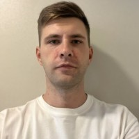
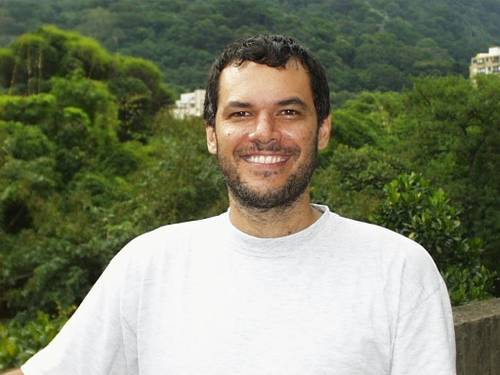
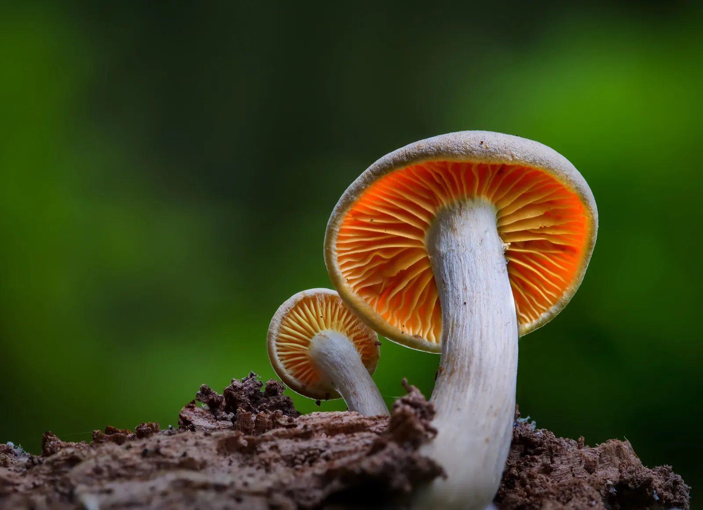

# SeniorYear-AboutMe
---
---
## Summary
Helloooo! I am Alyx/A1yx (This is my online surname. ), I love to do everything tech! I work at a Dairy Queen at my current time of writing this and take classes at SICTC! I usually show my online persona as a robotic version of a species of dragon called a nardoragon. 

[1]: https://lib.haxe.org/u/haxeflixel
[2]: https://en.wikipedia.org/wiki/Roberto_Ierusalimschy

Hobbies
- Music Composition (FL Studio)
- Digital Art (Ibis)
- Programming [Java, HTML, Lua, Hx/Haxe, Udon#] (Visual Studio Code)
- 3D Projects [URenders, Avatars, Worlds] (VRChat, Unity, Blender)
- Rhythm Games (Osu, FNF, NotITG, Stepmania, Quaver)
- VR Games (VRChat, Blade & Sorcery, Resonite)

My night time routine includes:

1. Shower or go to work.
2. Sit and eat with my mother if not at work.
3. Come home and shower if from work.
4. Get on computer and do various personal projects. (Ex: Yesterday I helped my mother clean, went out with her and my aunt to eat, then shopped for a bit, came home, and worked on Unity for a bit before getting on VRC. )
5. Do some VR games or Rhythm games maybe.
6. Go to sleep.

## My Moto
*It is the thrill of the hunt that matters, not the outcome. *

## Favorite Quotes

"**Life** is like a box of **chocolates**, you never know what you're going to get. " *-Forest Gump*

"I **see** you. I **feel** you. I **sense** you. And you don't even know, until it is too late, and I reveal myself. Then you're **mine**..." *-My fictional character. *

## My Favorite Websites

[Mosh](https://moshpro.app/lite) - Used for shader effects on pictures and stuff, very cewl!

[Gumroad](https://gumroad.com) - One of the **BEST** places to get assets for Unity and Blender!

## Persons of Interest

[Alexander Hohlov][1]

[Roberto Ierusalimschy][2]

# MUSHROOOOOOOOM!

## CS Terms
|Terms|Definitions|My Meaning|
|:-|:----:|-:|
|Vivid|Powerful, intensive color; Clear precise language.|Foggy or hard to comprehend or remember.|
|Oriflamme|A knight's battle standard.|To keep one's stance.|
|Eccentric|Of unvonventional and slightly strange character.|Very boastful emotions and sense of self.|
|Supine|Lying face upward; falling to act.|To be of positivity.|
